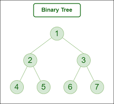

# C-ExercisesForInterviews

In this repository, I will collect the C codes that I faced during the interviews. Best!
Author: Mehmet cagri aksoy

## 1- Luhn Algorithm

The final digits of your credit card number is a check digit, akin to a checksum. The algorithm used to arrive at the proper check digit is called the Luhn algorithm, after IBM scientist Hans Peter Luhn (1896-1964). More info: https://www.groundlabs.com/blog/anatomy-of-a-credit-card/

## 2- Play with struct or raw data pass as a parameter

This kind of exercises often asking in the interviews, C is still using in embedded world and you need to pass the structs, raw data elements to the functions very often.

## 3- Password Strength Check

Have you curious about how the password strength check is working?
This function tells you if a password is strong or not. A strong password has these things: a capital letter, a small letter, a number, and a symbol. The function looks at each letter in the password and sees what kind it is.
If the password has all four kinds of letters, the function says yes. If not, it says no.

## 4- Phone Number OR String Formatting

Interview question explanation:

You are given a string to reformat. The string consists of N characters of letters, digits, spaces and/or dashes. The string always contains at least two alphanumeric characters. Spaces and dashes in the string should be ignored. We want to reformat the string so that the characters are grouped in blocks of three, separated by single spaces. If necessary, the final block or the last two blocks can be of length two.
"For example, given string S = ""AA-44 BB SSCD 83FG"", we would like to format it as "AA4 4BB SSC 083 FG"
"Write a function that, given such a string, returns this string reformatted as described above.
"Given S = ""0 - 22 198S - -324"", the function shouldreturn ""022 198 S3 24"

You should assume that:
• N is an integer within the range
[2..100];
• string S consists only of upper or
"lower case letters (a-zA-Z),digits"
"(0-9), spaces and/or dashes (-};"
• string S contains at least two
characters.

## 5- ASCII Character parsing

A random ASCII character is received every 100ms. We need to find a sequence of "GLROX"
characters. There can be other characters in between! Once found- call a Found function and
wait for the sequence again, if not found then wait until this sequence is found. If a new
character does not come in 2 seconds call Timeout function and wait for the whole "GLROX"
again even if previously received part of the sequence. The Process function which is your entry
point is called every 100ms.

## 6- Modulo test

The code should take integers from defined range e.g. 0-100 and process them as follows.
● If a number is divisible by 3, print “Global”
● If a number is divisible by 5, print “Logic”
● If a number is divisible by 3 AND by 5, print “GlobalLogic” in a single line
● Each printout should be done on a separate line.

## 7- Program for array left rotation by given index positions.

The task is to rotate the array elements to the left by index positions.
An example: https://www.geeksforgeeks.org/array-rotation/

## 8- Find the closest pair from two sorted arrays

This program is designed to find the closest pair from two sorted arrays. Given two sorted arrays and a number x, the function finds the pair whose sum is closest to x and the pair has an element from each array.

The function returns the closest pair of numbers. If there are multiple pairs with the same absolute difference, it returns one of them.

This program can be useful in various applications where you need to find pairs with specific properties from two sets of data. For example, it can be used in machine learning algorithms for nearest neighbor searches, or in database queries to find records with similar attributes.
An example: https://www.geeksforgeeks.org/given-two-sorted-arrays-number-x-find-pair-whose-sum-closest-x/

## 9- Polindome string

A palindrome string has some properties which are mentioned below:

A palindrome string has a symmetric structure which means that the character in the first half of the string are the same as in the rear half but in reverse order.
Any string of length 1 is always a palindrome.

## 10- Find the desired element and number of occurence it, given paragraph

The question is finding the number of element, how many times is mentioned a given paragraph.

## 11 - Find the most used,frequent or repeated word in given paragraph or text file.

Program to find the most repeated word in a string.
In this program, we must identify the term that appears the most in a given paragraph.line at a time, split, and store in an array. Find each word's frequency as you iterate through the array, then compare it to the maximum count. If frequency exceeds maxcount, the frequency should be stored in maxcount and the associated word should be stored in the variable word.

## 12 - Rat in maze problem with extended complexity!

Let's code another version of the rat in the maze experiment in C. For this, I used the standard 'backtracking' algorithm with recursive functions. A similar algorithm can be solved more effectively with stack and linked list relationships.
Coming to our question, our labyrinth consists of numbers and our goal is to follow the numbers from 1 to 16. Our algorithm first goes to location number 1 and moves 2, 3, 4 .. until it reaches 16. Unlike other examples, the algorithm can also go in diagonal directions, which increases complexity.

In the original question, there is an 8x8 array, so a 10x10 array is required. But for the sake of example, I loaded a 6x6 array.

## 13 - Radix sort implementation

A linear sorting method called Radix Sort sorts elements by going over each one digit by digit. It is a successful sorting technique for fixed-size keys in strings or integers.

## 14 - K-Unique Character finding

Have the function KUniqueCharacters(str) take the str parameter being passed and find the longest substring that contains k unique characters, where k will be the first character from the string. The substring will start from the second position in the string because the first character will be the integer k. For example: if str is "2aabbacbaa" there are several substrings that all contain 2 unique characters, namely: ["aabba", "ac", "cb", "ba"], but your program should return "aabba" because it is the longest substring. If there are multiple longest substrings, then return the first substring encountered with the longest length. k will range from 1 to 6.

## 15 - Moving median

Have the function "MovingMedian(arr)" read the array of numbers stored in arr which will contain a sliding window size, N, as the first element in the array and the rest will be a list of numbers. Your program should return the Moving Median for each element based on the element and its N-1 predecessors, where N is the sliding window size. The final output should be a string with the moving median corresponding to each entry in the original array separated by commas.

Note that for the first few elements (until the window size is reached), the median is computed on a smaller number of entries. For example: if arr is [3, 1, 3, 5, 10, 6, 4, 3, 1] then your program should output "1,2,3,5,6,6,4,3"

Examples

Input: {5, 2, 4, 6}
Output: 2,3,4
Input: {3, 0, 0, -2, 0, 2, 0, -2}
Output: 0,0,0,0,0,0,0

## 16 - Binary tree constructor and checker

Have the function TreeConstructor(strArr) take the array of strings stored in strArr, which will contain pairs of integers in the following format: (i1,i2), where i1 represents a child node in a tree and the second integer i2 signifies that it is the parent of i1.

For example: if strArr is ["(1,2)", "(2,4)", "(7,2)"],
then this forms the following tree:

which you can see forms a proper binary tree. Your program should, in this case, return the string true because a valid binary tree can be formed. If a proper binary tree cannot be formed with the integer pairs, then return the string false. All of the integers within the tree will be unique, which means there can only be one node in the tree with the given integer value.

## 17 - Palindrome String Creating

This code defines a function called PalindromeCreator that takes a string as input and checks if it can be turned into a palindrome by adding at most one character. If it can, the function prints the palindrome. If it can't, the function prints "not possible".

The function first checks if the input string is already a palindrome. If it is, the function prints "palindrome" and returns. If it's not, the function tries to create a palindrome by adding one character. It does this by checking every pair of characters that are not equal and trying to add a character between them that would make them equal. If it finds a solution, it prints the palindrome and returns. If it can't find a solution, it prints "not possible".

The main function calls the PalindromeCreator function with input from the standard input.
