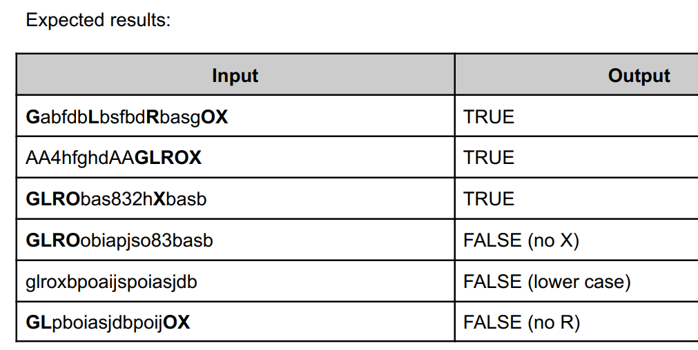
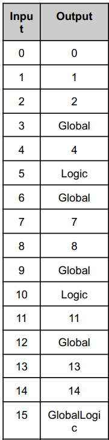

# C-ExercisesForInterviews
In this repository, I will collect the C codes that I faced during the interviews. Best!
Author: Mehmet cagri aksoy

## 1- Luhn Algorithm

The final digits of your credit card number is a check digit, akin to a checksum. The algorithm used to arrive at the proper check digit is called the Luhn algorithm, after IBM scientist Hans Peter Luhn (1896-1964). More info: https://www.groundlabs.com/blog/anatomy-of-a-credit-card/

## 2- Play with struct or raw data pass as a parameter
This kind of exercises often asking in the interviews, C is still using in embedded world and you need to pass the structs, raw data elements to the functions very often.

## 3- Password Strength Check
Have you curious about how the password strength check is working?
This function tells you if a password is strong or not. A strong password has these things: a capital letter, a small letter, a number, and a symbol. The function looks at each letter in the password and sees what kind it is. 
If the password has all four kinds of letters, the function says yes. If not, it says no.

## 4- Phone Number OR String Formatting
Interview question explanation:

You are given a string to reformat. The string consists of N characters of letters, digits, spaces and/or dashes. The string always contains at least two alphanumeric characters. Spaces and dashes in the string should be ignored. We want to reformat the string so that the characters are grouped in blocks of three, separated by single spaces. If necessary, the final block or the last two blocks can be of length two.
"For example, given string S = ""AA-44  BB  SSCD 83FG"", we would like to format it as "AA4 4BB SSC 083 FG"
"Write a function that, given such a string, returns this string reformatted as described above.
"Given S = ""0 -  22 198S - -324"", the function shouldreturn ""022 198 S3 24"

You should assume that:
• N is an integer within the range
[2..100];
• string S consists only of upper or
"lower case letters (a-zA-Z),digits"
"(0-9), spaces and/or dashes (-};"
• string S contains at least two
characters.

## 5- ASCII Character parsing

A random ASCII character is received every 100ms. We need to find a sequence of "GLROX"
characters. There can be other characters in between! Once found- call a Found function and
wait for the sequence again, if not found then wait until this sequence is found. If a new
character does not come in 2 seconds call Timeout function and wait for the whole "GLROX"
again even if previously received part of the sequence. The Process function which is your entry
point is called every 100ms.

## 6- Modulo test

The code should take integers from defined range e.g. 0-100 and process them as follows.
● If a number is divisible by 3, print “Global”
● If a number is divisible by 5, print “Logic”
● If a number is divisible by 3 AND by 5, print “GlobalLogic” in a single line
● Each printout should be done on a separate line.

## 7- Program for array left rotation by given index positions.

The task is to rotate the array elements to the left by index positions.
An example: https://www.geeksforgeeks.org/array-rotation/

## 8- Find the closest pair from two sorted arrays

Given two sorted arrays and a number x, 
find the pair whose sum is closest to x and the pair has an element from each array.
An example: https://www.geeksforgeeks.org/given-two-sorted-arrays-number-x-find-pair-whose-sum-closest-x/ 

## 9- Polindome string
A palindrome string has some properties which are mentioned below:

A palindrome string has a symmetric structure which means that the character in the first half of the string are the same as in the rear half but in reverse order.
Any string of length 1 is always a palindrome.
